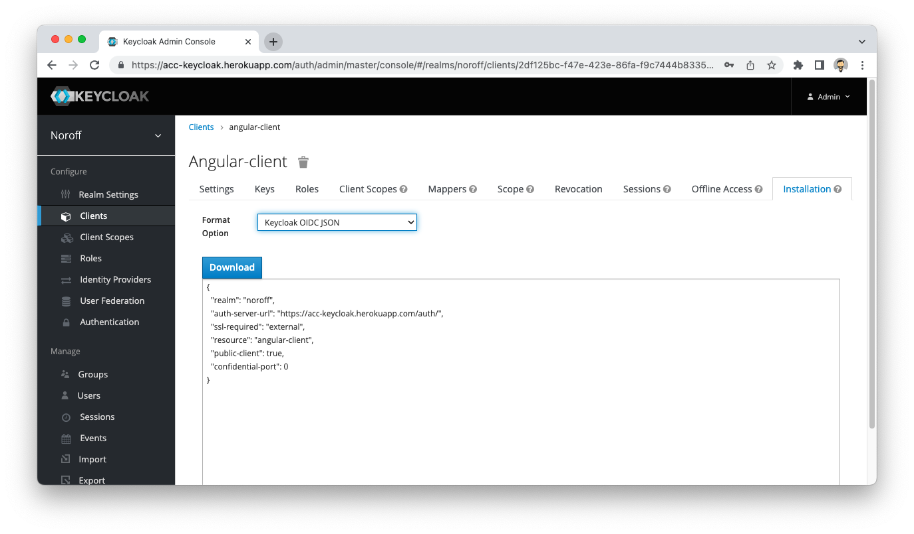

# Angular Keycloak Starter

> ## NB: Replace `assets/keycloak.json` with your own Keycloak configuration

## Table of contents

- [Background](#background)
- [Usage](#usage)
- [Keycloak](#keycloak)
- [HttpAuthInterceptor](#httpauthinterceptor)
- [Auth Guard](#auth-guard)
- [Role Guard](#role-guard)
- [Maintainers](#maintainers)
- [License](#license)

## Background

Angular starter that has Keycloak JS pre-installed.

## Usage

This project uses [NodeJS](https://nodejs.org/en/) and the [Angular Framework](https://angular.io).

### Install

Run the `install` command from the root directory of the project.

```sh
# Install dependencies for the project
npm install
````

### Run

Run the `serve` command from the root directory of the project.

```sh
# Run the project on localhost
ng serve
```

## Keycloak

This project uses [Keycloak](https://www.keycloak.org) and depends on an existing Keycloak instance to be deployed

> **NB - Remember to replace `assets/keycloak.json` with your own Keycloak configuration**



### Keycloak Instance

The project exposes a Keycloak Instance from the `src/keycloak.ts` file.

> **NB: Remember to _always_ import from `src/keycloak.ts` to get the instance with the authenticated user.**

## HttpAuthInterceptor

File: `src/interceptors/http-auth.interceptor.ts`

This service automatically adds the Keycloak token as an Authorization header to any outgoing HTTP request. No additional configuration is required.

## RefreshTokenHttpInterceptor

File: `src/interceptors/refresh-token-http.interceptor.ts`

The service checks if the token has expired, if it has, keycloak will refresh the token and update the keycloak instance with the new token. No further configuration required.

## Auth Guard

File: `src/guards/auth.guard.ts`

This service automatically redirects to the Login page if no authenticated user is present. This does NOT take into account the role of the logged in user.

## Role Guard

File: `src/guards/role.guard.ts`

This service automatically redirects to the Login page if no authenticated user is present. In addition, it also checks the current Role defined on the route. The role can be set using the data property on the route configuration in `src/app-routing.module.ts`.

```typescript
// File: src/app-routing.module.ts
...
const routes: Routes = [
  ...,
  {
    path: 'admin/dashboard', 
    component: AdminDashboardPage,
    canActivate: [RoleGuard],// Protected by Keycloak auth
    data: {
      role: "ADMIN" // Define the role required for this route
    }    
  }
];

...
```

## Maintainers

- [@dewald-els](https://github.com/dewald-els)

## License

Unlicensed
